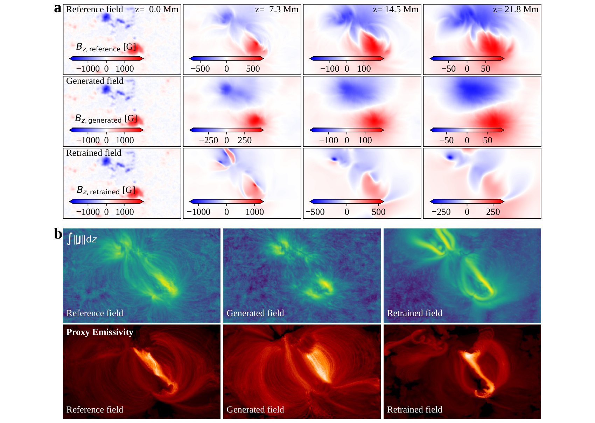
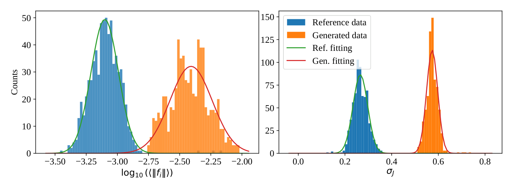
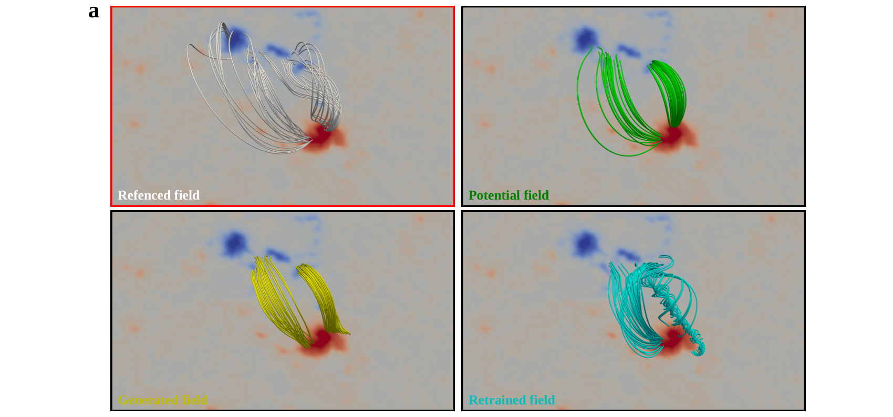
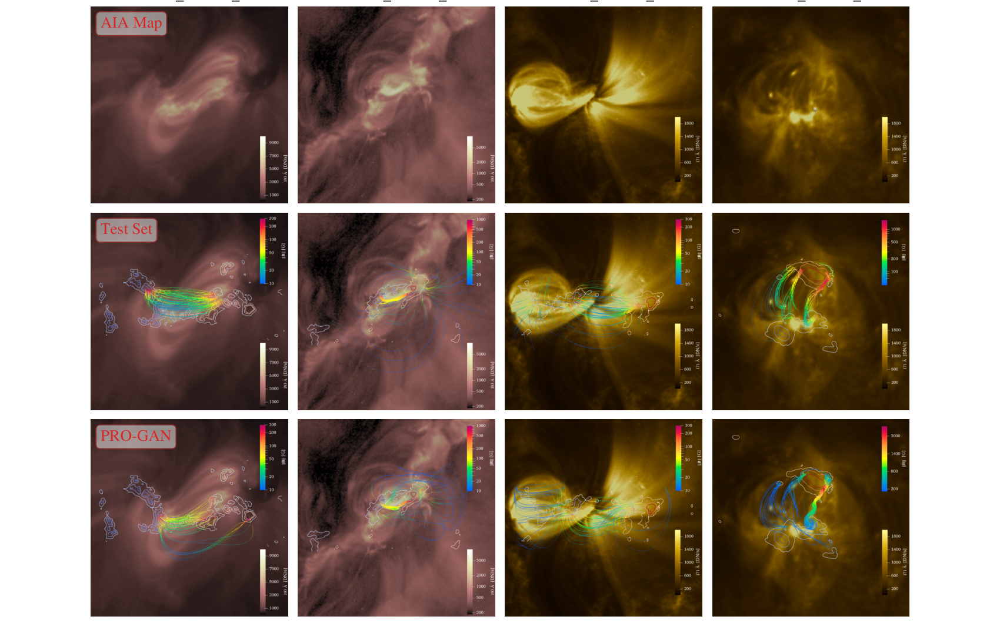
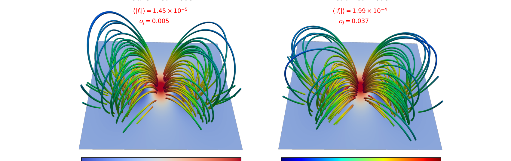
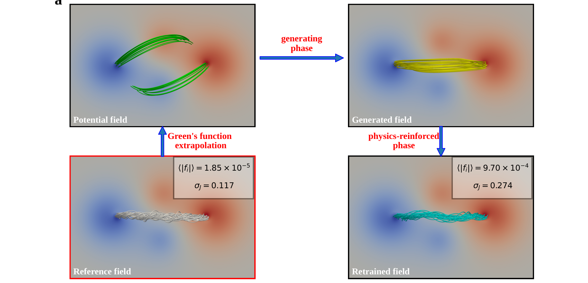

# A Novel Way for Extrapolating the Solar Magnetic Field with PRO-GAN

> [!info] 元信息
> **作者**: Guoyin Chen, Yang Guo, Qi Hao, Mingde Ding
> **年份**: 2026  **期刊**: The Astrophysical Journal  **DOI**: 10.3847/1538-4357/ae5108
> **Zotero**: [条目链接](zotero://select/items/JMEQ7ULW)

## 📌 速览（TL;DR）

本文提出 **PRO-GAN（physics-reinforced generative adversarial network，物理强化生成对抗网络）**，
一种把太阳势场快速转化为非线性无力场（NLFFF）的深度学习方法，核心是"双阶段"架构：
先由 3D U-Net + 3D PatchGAN 组成的生成对抗网络从大规模 NLFFF 数据集学习"势场 → NLFFF"
的映射（**生成阶段**，单次推理约 1 秒），再以有限差分离散化 + 传统数值优化方法（Wheatland
et al. 2000）提供的**梯度惩罚**进行二次训练（**物理强化阶段**），把生成场约束到无力
（force-free）与无散（divergence-free）方程上。

**要点**：
1. **问题痛点**：日冕磁场无法常规直接测量，NLFFF 外推是重建三维日冕磁场的主流手段，但传统
   数值方法（优化法、MHD 驰豫、Grad–Rubin 等）需要大量 CPU 机时；PINN 虽快却受困于多方程
   梯度冲突与全连接网络的可扩展性。
2. **方法创新**：以图像到图像翻译 GAN（3D 版）为骨架，将**数据驱动学习 + 方程正则化 + 数值
   求解器监督**三种信息源集成于一体；其新颖之处在于把传统数值算法的演进步长直接嵌入神经网络
   的训练梯度（梯度惩罚），从"新的视角"化解 PINN 梯度冲突。
3. **性能**：生成阶段在 NVIDIA A6000（64 GB 显存）上训练 9.22 小时（100 轮，batch size 4），
   推理约 1 秒，比传统数值方法快数千倍；物理强化对个例重训练约 0.85 小时（Low–Lou 模型
   10 000 步 0.28 小时，Titov–Démoulin 模型 20 000 步 5.35 小时）。
4. **验证**：在 683 个测试活动区、两个解析模型（Low–Lou、Titov–Démoulin）上均达到与参考场/
   解析解相当的力-无散指标；重训练场 $\sigma_J$、$\langle|f_i|\rangle$ 甚至优于测试集参考场
   （该参考场由数值优化法得到，并非真值）。
5. **代码开源**：PF2nlfff（GitHub 仓库 + Zenodo DOI 10.5281/zenodo.18972720）。

## 🎯 解决了什么问题（科学/技术问题）

**领域背景与痛点**：太阳磁场的光球层测量（基于塞曼效应）可靠且常规，但色球与日冕层密度和
磁场远低于光球，谱线线偏振信号弱，难以直接测量。目前通用的做法是把光球磁场作为底边界条件，
通过**磁场外推**求解平衡方程重建三维磁场。日冕 $\beta \ll 1$，NLFFF 模型是最简单也最常用的
近似。传统方法包括 (加权) 优化法（Wheatland et al. 2000; Wiegelmann 2004, 2007）、MHD
驰豫法（Yang et al. 1986; McClymont et al. 1997; Guo et al. 2016）、Grad–Rubin 法（Grad
& Rubin 1958; Sakurai 1981; Amari et al. 1997）、边界积分/格林函数法（Yan et al. 2001,
2006）以及将适用范围扩展到光球/色球的磁静力学（MHS）外推（Wiegelmann & Neukirch 2006）。
这些方法在超级计算机上仍要耗费大量 CPU 时间，难以用于空间天气预报这类强时效场景，也限制了
快速 NLFFF 初始条件下的 MHD 模拟。

**本文要解决的具体问题**：如何在**秒级**时间尺度上获得一个有物理保障的近似 NLFFF，并进一步
逼近真无力场。此前的深度学习路线分两类，各有缺陷：PINN（Raissi et al. 2017-2019; Jarolim
et al. 2023）用自动微分求解偏微分方程，但不同 PDE 损失项的梯度方向冲突使其难以最小化训练
误差，且普遍依赖全连接网络、复杂度难以匹配高维复杂方程；纯数据驱动的 GAN 虽能学到经验映射，
但受训练误差与泛化差距限制，结果往往偏离好的无力状态，且可能存在"幻觉"或过度平滑。

**为何重要**：本文提出了一个可复用的"神经网络 + 传统数值方法"深度融合范式：用预训练生成器
提供经验初值加速收敛，用有限差分把 PDE 离散成损失项，再用数值优化算法给出的理论梯度方向作为
惩罚项引导优化轨迹，从而同时解决效率、准确性与梯度冲突问题，为卷积网络与数值方法结合提供了
新路径。

## 🧭 章节精读

### § Abstract

**主要内容**：指出日冕磁场目前无法常规观测，NLFFF 外推是建模日冕磁场构型的关键手段；本文将
生成对抗网络与物理约束结合，提出 PRO-GAN 集成框架，把太阳势场高效转化为对应的 NLFFF，并在
物理约束下改进结果。该框架包含数据驱动映射学习、物理方程约束与数值求解器监督三大要素；在物理
强化训练中，以数值方法强化的梯度惩罚从新视角解决物理信息神经网络的梯度冲突问题。最后在数据集
和两个解析模型上验证了方法的有效性与效率。

**科学问题**：如何在保证物理自洽（无力、无散）的前提下极大提高日冕磁场外推的速度。

**方法**：双阶段深度学习框架——生成阶段 + 物理强化阶段（详见下文）。

**特征/性质/结论**：无缝融合数据驱动、方程约束与数值监督；实用性在 NLFFF 数据集与解析模型
上得到验证。

**研究价值**：为快速 NLFFF 外推提供新的深度学习方法，服务空间天气与时序 MHD 模拟。

**关键公式**：

无（摘要无公式）。

### § 1. Introduction

**主要内容**：梳理从光球磁场直接测量到日冕磁场重建的逻辑链条，综述 NLFFF 外推的经典数值方法
（加权优化法、MHD 驰豫法、Grad–Rubin 法、边界积分法、MHS 外推）及其缺陷，回顾 PINN 与生成
模型两条深度学习路径的优缺点，最后提出 PRO-GAN 的三信息源范式与开源实现。

**科学问题**：日冕磁场不可直接测量，需要利用光球矢量磁图外推；既有数值方法太慢，既有的深度
学习方法要么受梯度冲突困扰、要么缺乏物理保证。

**方法**：文献综述 + 提出"三信息源"架构：① 从经验数据集的数据驱动学习，② 基于偏微分方程的
物理正则化，③ 来自传统外推方法的数值约束。与 PINN 的区别在于引入数值引导机制来解决病态边值
问题中的梯度冲突；与传统生成模型的区别在于通过耦合 PDE 系统与离散数值公式施加硬约束。

**特征/性质/结论**：传统外推依赖于迭代求解，效率是发展的必要方向；PINN 的自由网格特性带来
离散化误差优势的同时引发梯度冲突；GAN 学到的 NLFFF 偏离无力状态；3D 卷积网络输出为离散数据
立方体，可直接在整个三维网格上训练（FCN 因内存不可行），代价是必须用有限差分替代自动微分、
引入截断误差，但这也打开了与数值方法深度结合的混合计算框架之门；预训练生成器可基于 Zhao 等
（2023）大尺度 NLFFF 数据集实现势场到近似 NLFFF 的直接迁移，再经物理强化二次训练得到良好
无力场。

**研究价值**：确立了"生成器预训练 + 物理强化二次训练"的路线，并强调卷积网络离散化特性与
数值方法的天然兼容性。

**关键公式**：

无（引言无编号公式）。

### § 2. Methods

**主要内容**：总体介绍 PRO-GAN 的双阶段结构与训练策略，给出图 1 的架构示意说明：红色区域为
生成阶段，蓝色区域为物理强化阶段，紫色为两阶段共享的生成器（把势场转换为目标 NLFFF）。

**科学问题**：如何设计一个既能高效生成近似 NLFFF、又能被物理方程与数值方法约束修正的网络架构。

**方法**：3D 卷积 U-Net 生成器 + 3D PatchGAN 判别器 + 有限差分方程损失 + 数值梯度惩罚。

**特征/性质/结论**：PRO-GAN 用"混合训练"实现生成器优化——常规对抗训练实现数据驱动学习，
方程与数值技术引导实现物理强化正则化。

**研究价值**：确立了后续各节展开的方法细节框架。

**关键公式**：

无（本节仅框架性描述，公式见 2.1 与 2.2）。

### § 2.1. Generative Stage

**主要内容**：生成阶段基于现有 NLFFF 数据集学习势场与 NLFFF 之间的经验映射（一种风格迁移）。
输入不是光球边界数据立方体，而是"以观测场替换底部边界的势场"；若仅用边界场作输入，三维输出
需要增加层数，但 CNN 输出通道数固定，会限制高度分辨率。生成器采用 3D U-Net（Çiçek et al.
2016），即把 U-Net 的全部卷积替换为 3D 卷积，额外深度维参与卷积滑动操作，从而提取磁场的立
体结构；作者特别说明，曾尝试用普通卷积的通道维补充第三空间维（把每个 z 平面当作图像通道），
效果不佳，因为通道维只做特征叠加而不参与卷积，而深度维才作为第三空间轴参与卷积滑动。
判别器采用 3D 版 PatchGAN（Isola et al. 2017）：输出不是表示真伪概率的标量，而是三维数组，
每个元素对局部块作真伪判定，从而更好地学习数据集的局部特征。

**科学问题**：如何用数据驱动方法快速得到"势场 → NLFFF"的近似映射，并保证输出结构与输入
（势场）规格一致、保留局部磁场特征。

**方法**：单次训练迭代中计算三类损失并执行两次反向传播：先优化生成器（条件 GAN 损失 + L1
损失），再优化判别器（二分类交叉熵损失）。使用 L1 而非 L2 回归项，因为 L2 与人类视觉系统
不一致、易产生斑状伪影，L1 更稳健、惩罚不过度。

**特征/性质/结论**：生成器的整体损失为条件 GAN 损失与 L1 损失的加权和；该组合既让生成场在
分布上逼真，又在局部特征上贴近训练集，比像素级损失更能恢复自然真实的纹理细节。训练完成后，
生成器可在约 1 秒内把势场转换为 NLFFF。

**研究价值**：给出了可训练的 3D 体积到体积翻译架构及其损失设计，并论证 3D 卷积的必要性。

**关键公式**：

条件 GAN 损失函数（式 1）：

$$
\mathcal{L}_{cGAN}(G, D) = \mathbb{E}_{x,y}\left[\log D(x, y)\right] + \mathbb{E}_{x}\left[\log\left(1 - D(x, G(x))\right)\right]
$$

其中 $x$ 为生成器输入（以观测场替换底部边界的势场），$y$ 为真值 NLFFF，$G(x)$ 为生成器
输出；该式表示判别器对"真实场对"分对的期望对数概率与对"生成场"判伪的期望对数概率之和。

L1 损失函数（式 2）：

$$
\mathcal{L}_{L1}(G) = \mathbb{E}_{x,y}\left[\| y - G(x) \|_1\right]
$$

衡量生成输出与训练集数据的逐点绝对误差，促使生成场在局部特征上回归训练集分布。

生成器整体损失（式 3）：

$$
\mathcal{L}_G = \mathcal{L}_{cGAN} + \lambda \cdot \mathcal{L}_{L1}
$$

$\lambda$ 为控制 L1 损失影响权重的超参数。该组合让生成器既通过 $\mathcal{L}_{cGAN}$ 学习
生成逼真场，又通过 $\mathcal{L}_{L1}$ 保证局部特征与训练集相似。

判别器损失（式 4）：

$$
\mathcal{L}_D = \mathbb{E}_{x,y}\left[\log D(x, y)\right] + \mathbb{E}_{x}\left[\log\left(1 - D(x, G(x))\right)\right]
$$

（式中真实样本下标为 real，生成样本下标为 fake。）该式保证判别器最大化正确分类真实场为真、
并把生成场判为假的概率；一次完整训练迭代先按式 (3) 优化生成器、再按式 (4) 优化判别器。

### § 2.2. Physics Reinforcement Stage

**主要内容**：物理强化阶段借鉴 PINN 思想，分别通过损失函数与梯度惩罚集成方程信息与数值算法。
由于 3D 卷积网络的数据点之间存在几何关系，有限差分是高效的微分算子计算方式。作者指出：方程
损失（式 5）第一项形式与优化松弛外推法（Wheatland et al. 2000; Wiegelmann et al. 2006,
2007, 2008）的目标函数一致；第二项为底边界条件约束；最后两项对无力度指标 $\sigma_J$ 与
无散度指标 $\langle|f_i|\rangle$ 施加正则，因为仅降低洛伦兹力可能让这两项仍然过大。
训练设置方面强调：边界权重 $\lambda_{bc}$ 应比力-无散条件权重高一个量级，初值学习率应尽
可能大但保持损失曲线稳定下降、避免剧烈振荡，并配合学习率调度器；作者选用 AdamW 优化器与
StepLR 调度器。

**科学问题**：如何在获得近似 NLFFF 之后，通过无监督的二次训练把它推向真正的无力场，并解决
"力-无散边值问题不适定"（解的存在唯一性无保证）导致神经网络的局部极小可能对应非物理场的问题。

**方法**：以损失函数 $\mathcal{L}_{eq}$（式 5）反向传播逼近无力方程（式 6）；同时嵌入由
数值优化方法（Wheatland et al. 2000）给出的梯度惩罚——在反向传播的链式法则计算中，把雅可比
矩阵替换为 $(\partial G_{\mathrm{Net}} + \Delta\mathbf{B}_{x,y,z})/\partial O^{(N)}$。为简化计算，把最终梯度拆成两步顺序执行：先算原梯度 $\partial G_{\mathrm{Net}}/\partial O^{(N)}$，再算惩罚梯度 $\Delta\mathbf{B}_{x,y,z}/\partial O^{(N)}$，依据 $(\partial G_{\mathrm{Net}} + \Delta\mathbf{B}_{x,y,z})/\partial O^{(N)} = \partial G_{\mathrm{Net}}/\partial O^{(N)} + \Delta\mathbf{B}_{x,y,z}/\partial O^{(N)}$ 分两次优化。

**特征/性质/结论**：该二次训练等效于"把神经网络当作参数化模型去最好地拟合微分方程"；梯度
惩罚在理论上给网络提供了"不仅知道要到达哪里、而且给出参数空间中的可靠方向"，从而克服不同
损失项梯度方向相反造成的**梯度冲突**——这是当前大语言模型与 PINN 公认的难题。作者在本节
坦承其局限：有限差分引入了截断误差；物理强化为每个不同输入磁场调超参；边界约束若被破坏会
直接导致错误磁场。

**研究价值**：提出"数值方法嵌入神经网络梯度"的机制（本质上是在 GPU 上用神经网络框架重建
数值模拟），可推广到任何卷积网络 + 数值算法的组合。

**关键公式**：

物理强化损失函数（式 5）：

$$
\mathcal{L}_{eq} = \lambda_{ff}\int_V \frac{\left|(\nabla\times\mathbf{B})\times\mathbf{B}\right|^2}{B^2}\,dV + \lambda_{div}\int_V (\nabla\cdot\mathbf{B})^2\,dV + \lambda_{bc}\int_S (\mathbf{B}-\mathbf{B}_0)^2\,dS + \lambda_{fi}\langle|f_i|\rangle + \lambda_{\sigma J}\sigma_J
$$

第一项（$\lambda_{ff}$ 项）与优化松弛外推法的目标函数一致，代表物理方程约束；第二项
（$\lambda_{div}$ 项）约束磁场的无散性；第三项（$\lambda_{bc}$ 项）约束底边界与观测矢量场
$\mathbf{B}_0$ 一致；最后两项分别约束无力度指标 $\sigma_J$ 与无散度指标
$\langle|f_i|\rangle$，防止洛伦兹力下降但指标仍然偏大。

无力方程（式 6）：

$$
(\nabla\times\mathbf{B}) = \alpha\mathbf{B}, \qquad \nabla\cdot\mathbf{B} = 0
$$

表示电流密度 $\mathbf{J} = \nabla\times\mathbf{B}$ 与磁场 $\mathbf{B}$ 平行（$\alpha$ 为随
位置变化的标量函数），且磁场无散；这正是 NLFFF 的基本定义，也是物理强化训练的"目标方程"。

数值优化梯度（式 7、8）：

$$
\frac{\partial \mathbf{B}}{\partial t} = \mu\left[\nabla\times(\boldsymbol{\Omega}\times\mathbf{B}) - \boldsymbol{\Omega}\times(\nabla\times\mathbf{B}) - \nabla(\boldsymbol{\Omega}\cdot\mathbf{B}) + \boldsymbol{\Omega}(\nabla\cdot\mathbf{B}) + (\boldsymbol{\Omega}\cdot\boldsymbol{\Omega})\mathbf{B}\right]
$$

$$
\boldsymbol{\Omega} = B^{-2}\left[(\nabla\times\mathbf{B})\times\mathbf{B} - (\nabla\cdot\mathbf{B})\mathbf{B}\right]
$$

式 (8) 定义的辅助矢量 $\boldsymbol{\Omega}$ 与 Wheatland 等（2000）优化法中的 $\mathbf{X}$
同源；式 (7) 给出按优化方程前进一步得到的磁场演化梯度，本文将其离散一步作为 $\Delta\mathbf{B}$
叠加进反向传播梯度（梯度惩罚）。这样的数值梯度方向来自成熟的数值方法，可矫正纯数据驱动
梯度可能偏离物理的方向。

### § 3. Results

**主要内容**：把 PRO-GAN 应用于具体观测并与传统外推方法及解析解比较。分为两部分：
(1) 测试集上的生成阶段结果与其物理强化后的改进结果；(2) 物理强化结果与两个解析 NLFFF
解（Titov–Démoulin 模型与 Low–Lou 解）的比较。

**科学问题**：PRO-GAN 是否能在保持快速的同时达到与数值法/解析解相当的力-无散精度，并在
真实观测形态上得到验证。

**方法**：332 个训练样本 + 683 个测试样本（见 3.1 数据集说明）；物理强化二次训练；解析模型
验证流程（格林函数势场外推 → 替换底边界横向场 → 生成器转换 → 物理强化）。训练细节：生成阶段在 NVIDIA A6000 GPU（64 GB 显存）上以 batch size 4 训练 100 轮，耗时 9.22 小时；生成器参数超过 9000 万；计算过的最大磁场立方体尺寸为 $256\times192\times256$，几乎耗尽 64 GB 显存。

**特征/性质/结论**：详见 3.1、3.2 各节数值结论。总体而言，物理强化后的重训练场在
$\sigma_J$ 与 $\langle|f_i|\rangle$ 指标上优于测试集参考场与生成场，并与解析模型高度一致。

**研究价值**：证明该框架在真实观测（含不同波段形态结构）与理想解析模型两方面的实用性与
泛化能力。

**关键公式**：

无（本节数值结论为主；评估指标公式见下文 3.1 与图 3、4 说明）。

### § 3.1. Comparison with the Test Set

**主要内容**：本节给出测试集比较的完整流程与量化结果。数据来自 Zhao 等（2023）的大尺度
3D NLFFF 数据集（2010–2019 年逾 70 000 个活动区、总数据量超过 200 TB），作者下载其中
1015 个，332 个作训练集、剩余 683 个作测试集——之所以只用 332 个训练样本，是因为无力方程
解空间高度结构化，要学习的语义特征就是"最小化电流剪切与磁散度"，且 U-Net 类网络在有限样本
下的强泛化能力已得到验证，同时可降低训练成本。网络输入为 $[b\times 3\times n_x\times n_y\times n_z]$，由于 U-Net 经池化下采样三次，$n_x, n_y, n_z$ 需能被 8 整除；水平方向上下
边缘裁剪，$z$ 方向保留底边界、只裁顶端。势场本身由底边界法向分量唯一确定，因此还需把势场
底边界替换为观测底边界，这相当于给无电流场注入底部电流（非势成分）。

**结果**：以 HARP 2923（2013 年 7 月 2 日 08:00 UT）为个例：图 2(a) 显示底部边界 $B_z$
在三种场中一致，说明两阶段都满足了边界条件；但高层生成场只保留了整体分布、细节变得弥散；
物理强化后的重训练场更贴近参考分布、磁场衰减更慢（更凝聚）。度量方面：测试集整体统计
（683 例）中，生成场 $\langle|f_i|\rangle = 3.9\times10^{-3}$、$\sigma_J = 0.573$，
参考场 $\langle|f_i|\rangle = 7.9\times10^{-4}$、$\sigma_J = 0.266$；对 HARP 2923
个例，参考/生成/重训练场的 $\sigma_J$ 分别为 0.22、0.53、0.18，$\langle|f_i|\rangle$
分别为 $0.99\times10^{-3}$、$1.84\times10^{-3}$、$0.79\times10^{-3}$——重训练场
拟合无力状态最好，其次为参考场，生成场偏差最大。作者据此指出：优化松弛法从势场初值出发
迭代、易收敛到靠近初值的局部极小，因此数值外推模型的场（如势场）衰减更快、可能低估低日冕
区域的磁场强度；而非势 NLFFF 因强电流效应衰减更慢，物理强化产生的重训练场衰减更慢或与此
相符。图 3 显示 $\log_{10}\langle|f_i|\rangle$ 与 $\sigma_J$ 在 683 个测试样本上呈高斯
分布；图 4 给出逐格点分析：(b) 无量纲散度 $f_i$ 分布重训练场方差最小，说明无散性质统计
上更好；(c) $\theta$（电流 $\mathbf{J}$ 与磁场 $\mathbf{B}$ 夹角）对归一化电流
$J_i/\langle J_i\rangle$ 的分布中，重训练场最接近理想无力场（势分量位于 $J_i=0$ 线、
非势分量位于 $\theta=0$ 线），生成场分布更弥散。图 4(a) 磁力线俯视图中，重训练场出现
两根扭曲磁流绳，原左侧磁拱也演化为扭曲更明显的磁流绳；生成场仅在足点附近有轻微扭曲。
泛化验证（图 5）：HARPNUM 89、1948、1651、2923 四个活动区，89 与 1948 对齐 193 Å、
1651 与 2923 对齐 171 Å；PRO-GAN 生成场在场线走向与整体形态上比测试集参考场更符合 EUV
观测，例如 HARPNUM 89 中亮等离子体沿东北–西南方向分布，参考场呈东西走向，而 PRO-GAN 更
贴合观测；HARPNUM 1651 东侧闭合结构被 PRO-GAN 成功复现，参考场却含部分开放场线。

**科学问题**：生成阶段与物理强化阶段的定量差距有多大、重训练场是否真的更无力无散、以及
模型是否具备跨活动区的泛化能力。

**方法**：683 样本的统计比较 + 个例（HARP 2923）的多高度层 $B_z$ 对比 + 代理发射率
（proxy emissivity）与积分电流分布形态对比 + 逐格点分布分析 + AIA EUV 图像重投影对比。

**特征/性质/结论**：生成阶段千倍提速的同时力-无散指标较差，适合时效性优先的任务（如空间
天气预报、耀斑预报）；物理强化阶段（约 0.85 小时/个例）把精度提升到甚至优于参考数值模型
的水平，且重训练过程无需监督。评估指标定义：无量纲散度 $f_i = (\nabla\cdot\mathbf{B})_i\Delta V_i / (B_i \Delta S_i)$，平均后得到 $\langle|f_i|\rangle$；$\sigma_J$ 为电流加权平均的 $\mathbf{J}$ 与 $\mathbf{B}$ 夹角正弦，二者越小代表场越接近无力无散状态。

**研究价值**：提供了"快而粗的 GAN 场"与"慢而准的物理强化场"两种工作模式选择，并展示
AIU 重投影这种与观测直接比较的实用验证手段。

**关键公式**：

无量纲散度指标（图 4 相关）：

$$
f_i = \frac{(\nabla\cdot\mathbf{B})_i \Delta V_i}{B_i \Delta S_i}
$$

其中脚标 $i$ 为网格点，$\Delta V_i$、$\Delta S_i$ 为网格体积与面积元；该量用于逐格点评价无散
程度，平均后得到 $\langle|f_i|\rangle$，越小越好。

无力度指标 $\sigma_J$：

$$
\sigma_J = \frac{\sum_i J_i \sin\theta_i}{\sum_i J_i}
$$

其中 $\sin\theta_i = |\mathbf{J}\times\mathbf{B}|_i / (J_i B_i)$，即电流按幅度加权的电流—
磁场夹角正弦；$\sigma_J = 0$ 对应完全无力。

### § 3.2. Comparison with Analytical Solutions

**主要内容**：用两个经典解析无力场——Titov–Démoulin 模型（Titov & Démoulin 1999;
Titov et al. 2014）与 Low–Lou 模型（Low & Lou 1990）验证泛化性。流程四步：(1) 以解析场
建立底边界，用格林函数法外推势场；(2) 把势场底边界的横向磁场替换为理论模型的横向场；(3)
生成器把修改后的势场转换为粗糙的初始无力场；(4) 把物理强化技术（Section 2 的方法）接入训练
过程，使输出场达到与解析模型相当的水平。

**结果**：Low–Lou 模型取自由常数 $n=1$、本征阶数 $m=1$，几何参数取点源深度 $l=0.3$、
对称轴角 $\Phi=\pi/2$；重训练场训练 10 000 轮（0.28 小时）后，构型与理论模型非常相似
（图 6a），$\sigma_J$ 与 $\langle|f_i|\rangle$ 降到 0.037 与 $1.99\times10^{-4}$
（解析模型本身为 0.005 与 $1.45\times10^{-5}$）；图 6(b) 显示 $L$、$\sigma_J$、
$\langle|f_i|\rangle$ 三个指标随轮数持续下降。Titov–Démoulin 模型取 $a/d=0.31$、
$q=1\times10^{14}$（$a$ 为磁流绳小半径、$d$ 为电流环中心深度、$q$ 为生成背景场的磁荷
强度），与 Valori 等（2016）一致（$N=3$、$\Delta=0.06$）；GAN 先给出轻微扭曲的粗糙磁流绳，
经 20 000 轮（5.35 小时）物理强化后达到 $\sigma_J = 0.274$、$\langle|f_i|\rangle = 9.70\times10^{-4}$（解析模型分别为 0.117 与 $1.85\times10^{-5}$），且特征持续改进
（图 7b）。表 1 用 Schrijver 等（2006）与 Metcalf 等（2008）的标准指标（矢量相关
$C_{\mathrm{vec}}$、Cauchy–Schwarz 指标 $C_{CS}$、归一化矢量误差 $1-E_n$、平均矢量
误差 $1-E_m$、归一化磁场能量 $\varepsilon$）衡量重训练场与解析模型的一致性：Low–Lou
为 0.998、0.925、0.894、0.724、1.007；Titov–Démoulin 为 0.979、0.983、0.883、
0.828、1.013，全部接近 1（$\varepsilon$ 接近 1 表示最接近），说明物理强化阶段成功复现了
希望的磁场特征与关键信息。

**科学问题**：PRO-GAN（特别是物理强化阶段）能否在真实观测之外的理想解析检验中复现已知
磁流绳构型与无力解。

**方法**：格林函数势场外推 + 底边界替换 + 生成器转换 + 物理强化二次训练；以标准指标与
收敛曲线评估。

**特征/性质/结论**：重训练场能复原 Low–Lou 与 Titov–Démoulin 两类代表性无力场构型
（分属简单无力场与磁流绳类结构）；训练轮数与所需时间随模型复杂度上升（Low–Lou 10 000 轮
0.28 小时 vs Titov–Démoulin 20 000 轮 5.35 小时）。

**研究价值**：证明方法对"观测型"与"解析型"两类任务均有效，为后续把 MHS 外推、太阳风
模型等更多均衡状态引入重训练流程提供了基础。

**关键公式**：

线性无力场本质（$\alpha$ 定义）：$\nabla\times\mathbf{B} = \alpha\mathbf{B}$（$\alpha$
为常数时为线性无力场，Low–Lou、Titov–Démoulin 均为其非线性变体）。

表 1 指标（Schrijver et al. 2006; Metcalf et al. 2008 约定）：

$$
C_{\mathrm{vec}} = \frac{\sum_i \mathbf{B}_i\cdot\mathbf{b}_i}{\sqrt{\sum_i |\mathbf{B}_i|^2 \sum_i |\mathbf{b}_i|^2}}, \qquad
C_{CS} = \left\langle\frac{\mathbf{B}\cdot\mathbf{b}}{|\mathbf{B}|\,|\mathbf{b}|}\right\rangle
$$

$$
E_n = \frac{\sum_i |\mathbf{b}_i-\mathbf{B}_i|}{\sum_i |\mathbf{B}_i|}, \qquad
E_m = \left\langle\frac{|\mathbf{b}-\mathbf{B}|}{|\mathbf{B}|}\right\rangle, \qquad
\varepsilon = \frac{\sum_i |\mathbf{b}_i|^2}{\sum_i |\mathbf{B}_i|^2}
$$

其中 $\mathbf{B}$ 为参考场、$\mathbf{b}$ 为重训练场；$\varepsilon \to 1$ 表示磁场能量
比最接近。数值（表 1，LL / TD 行）：$\langle|f_i|\rangle_0\,(10^{-4})$、$\langle|f_i|\rangle\,(10^{-4})$、$\sigma_{J,0}$、$\sigma_J$、$C_{\mathrm{vec}}$、$C_{CS}$、$1-E_n$、$1-E_m$、$\varepsilon$ = 0.15 / 0.19、1.99 / 9.70、0.005 / 0.118、
0.037 / 0.274、0.998 / 0.979、0.925 / 0.983、0.894 / 0.883、0.724 / 0.828、
1.007 / 1.013。

### § 4. Summary and Discussion

**主要内容**：总结 PRO-GAN 框架与 PF2nlfff 工具；与 PINN 方法（Jarolim et al. 2023）详细
对比；讨论梯度冲突的解决思路（对比自适应加权、二阶优化器等方案）；阐述 GAN 幻觉与过度平滑
问题被物理强化修正的机理；说明局限性与未来方向。

**科学问题**：比较 3D 卷积网络 + 有限差分与 PINN（FCN + 自动微分）方案的取舍；如何把数值
方法"直接嵌入"神经网络；GAN + 物理强化的结合价值。

**方法**：方法学讨论 + 局限性分析。

**特征/性质/结论**：PINN 依赖 FCN 与自动微分，复杂大尺度磁场数据上收敛不佳；本文改用参数
更多、能提取 3D 特征的卷积网络，代价是失去网格自由、必须以有限差分计算微分算子、引入截断
误差——但模型复杂度提升一般能降低训练误差，改善的精度可以盖过离散化与截断误差。生成器可
作为物理信息训练的初始网络，比 Xavier/随机初始化更快更准地收敛。把 Wheatland 等（2000）
的数值梯度作为梯度惩罚，等效于在 GPU 上用神经网络框架"重新实现数值模拟"，从而把"要去哪"
（损失）与"怎么走"（数值梯度）结合，克服梯度方向相反的梯度冲突；该方法也被作者视为卷积网络
与传统数值方法结合的有效范例。局限性：(1) 强依赖 GPU 资源——3D 卷积网络参数超 9000 万，
反向传播需存储梯度图，最大数据立方体 $256\times192\times256$ 几乎耗尽 A6000 的 64 GB
显存；(2) 高精度需求下训练耗时与大量 CPU 计算相当，不能加速高精度计算，但可获得力-无散
性质好的磁场数据；(3) 测试集参考场来自 Wiegelmann（2008）优化算法、并非真值，故比较只能
说明能改进某一特定数值方法的结果；解析解检验也仅限简单情况，尚不足以证明在复杂观测磁场中的
普适性。

**研究价值**：提出"深度学习与传统数值方法紧密结合"的方法论；生成阶段强调用 GAN 做风格迁移
而非简单端到端模型（因为从势场到无力场本质是改变电流分布、无力程度与场线扭曲，同时保持极性
分布与整体拓扑，GAN 学习的是数据分布特征而非简单输入-标签映射，且数值法生成的数据集并非精确
解、端到端训练在非完备数据集上次优）。未来工作可把 MHS 外推（实现磁静力平衡）与驰豫太阳风
模型（获得带太阳风外流的磁场构型）纳入重训练；神经算子方向（DeepONet、FNO、PINO、
global-local FNO）表明混合"物理约束 + 数据学习 + 算子学习 + 数值引导"的架构潜力巨大，
PRO-GAN 的生成器天然适合加一层傅里叶层以学习势场到 NLFFF 的算子映射。

**关键公式**：

无（本节不含新编号公式；引用式 (6)、(7) 等已有公式）。

### § Acknowledgments / References

**主要内容**：致谢 SDO 团队提供 HMI 矢量磁场数据、国家天文台发布大尺度 NLFFF 数据集，以及
对神经网络有详细讨论的博士生 Zhao Shunjing；作者受国家重点研发计划
（2022YFF0503004、2021YFA1600504、2020YFC2201200）、国家自然科学基金（12333009、
12173019）与中央高校基本科研业务费（KG202506）资助。参考文献覆盖 NLFFF 外推经典方法、
PINN 与 GAN 基础文献、神经算子、大尺度数据集等。代码与数据公开：GitHub
（github.com/gychen-NJU/PF2nlfff）与 Zenodo（DOI 10.5281/zenodo.18972720）。

**科学问题**：无（致谢与参考文献部分）。

**方法**：无。

**特征/性质/结论**：代码以 Python 库形式发布；数据集来自国家天文台与 SDO/HMI。

**研究价值**：可复现性保障。

**关键公式**：

无。

## 🖼️ 图表详解

> [!note] 说明
> 以下图表解说基于论文题注、PDF 文本层标注与正文描述撰写；各图均为论文原图，位于
> `assets/JMEQ7ULW/` 下。

### 图 1（第 3 页）

> [!quote] 原题注：Figure 1. Network architecture and training strategy. The PRO-GAN architecture operates through two distinct yet complementary stages, as illustrated in the schematic diagram. The generative stage (outlined in red rectangular frame) and physics reinforcement stage (outlined in blue rectangular frame) work in coordination, with their overlapping region shown in purple (color overlap), indicating shared parts. Blue arrows represent backpropagation pathways, gray arrows indicate data flow direction for inputs/outputs, and the orange arrow denotes gradient penalty application.

**图表内容**：PRO-GAN 双阶段网络架构与训练流程示意图。图中红色大框为生成阶段（Generative
phase），蓝色大框为物理强化阶段（Physics reinforcement phase），两者交叠的紫色区域为共享
的生成器（3D Unet Generator）；（蓝色箭头为反向传播通路，灰色箭头为输入/输出数据流
方向，橙色箭头表示梯度惩罚施加位置）。

**图内解说**：从左到右：输入为尺寸 $3\times n_x\times n_y\times n_z$ 的势场数据立方体
（Potential field），其底边界经 B.P.（底边界替换处理，即把观测光球矢量场替换到势场底部）注入观测分量；
紫色区域中生成器 GNet 与判别器 DNet（Patch GAN Discriminator，红色框内右侧）构成 cGAN
对抗训练，生成阶段同时计算 cGAN Loss 与 L1 Loss，输出 Generated field（红色框）。蓝色
物理强化阶段以生成器输出的 Generated field 为起点，经有限差分（Finite difference）算子
计算 $\partial\mathbf{B}_x,\mathbf{B}_y,\mathbf{B}_z / \partial x,y,z$，配合梯度惩罚
（Gradient penalty，来自数值方法的 $\partial\mathbf{B}_{\mathrm{num}}$，即图中的 Eq. 7）
与 $\mathcal{L}_{eq}$ Loss（Eq. 5）做二次训练，输出 Retrained field；反向传播（Back
propagation / B.P.）贯穿两个阶段，橙色箭头在梯度惩罚处标注。

**科学内涵**：该图直观呈现论文核心思想——两阶段共享同一生成器（紫色），数据驱动（红框）
负责"快速学得映射"，物理增强（蓝框）负责"把结果推向真实无力场"，且数值算法以梯度惩罚的
形式参与训练而非仅作后处理。

### 图 2（第 6 页）

> [!quote] 原题注：Figure 2. Comparison between the reference, generated, and retrained fields. (a) Comparison between the reference, generated, and retrained fields at different height levels. The three rows show the different models, and the four columns display Bz at different heights. (b) Proxy emissivity maps and the integrated current distributions of these three fields, showing the 3D configuration of the magnetic field.

**图表内容**：(a) 参考场（Reference field）、生成场（Generated field）、重训练场
（Retrained field）在不同高度层的 $B_z$ 切片对比：三行对应三种场，四列对应 $z = 0.0$、
7.3、14.5、21.8 Mm 四个高度；各图共用色标（$B_z$ 单位 G，范围约 $-1000$ 到 $1000$ G，
底部层另有 $-500$–$500$ 与 $-100$–$100$ 等次级色标）；(b) 三种场的代理发射率
（Proxy Emissivity）图与积分电流分布（$\int J\,dz$），展示磁场三维构型。

**图内解说**：(a) 中第一列（$z = 0.0$ Mm）三行图几乎一致，说明两阶段都严格满足底边界
观测；随高度增加（$z = 7.3$、14.5、21.8 Mm），生成场（第二行）逐渐失去细结构、变弥散，
重训练场（第三行）保持较紧凑的负极性结构与更强的残余磁场（衰减更慢），与参考场（第一行）
更接近但整体更凝聚。(b) 中代理发射率把磁场转化为类似观测辐射的三维伪等离子体形态，积分
电流分布 $\int J\,dz$ 显示焦耳加热源；生成场只保留了与参考场相似的电流特征、扭曲不足、
未形成磁流绳；重训练场则重建出更强的扭曲磁流绳与电流。

**科学内涵**：该图说明：① 两阶段满足底部边界条件；② 纯 GAN 生成场高度方向上抹平了结构；
③ 物理强化阶段恢复了磁流绳等关键非势结构。特别地，重训练场在特定高度上磁场的衰减慢于
参考场（参考场从势场初值优化得到、接近初始态），提示数值外推可能低估低日冕磁场幅度，而非势
NLFFF 因强电流效应衰减更慢。

### 图 3（第 7 页）

> [!quote] 原题注：Figure 3. Statistical comparison of the test set and generated data statistics of the logarithmic divergence-free and force-free metrics for the 683 test cases, which have obvious Gaussian distributions and are fitted by Gaussian profiles.

**图表内容**：683 个测试样本的指标分布直方图。左图横轴为 $\log_{10}\langle|f_i|\rangle$
（范围约 $-3.5$ 到 $-2.0$，纵轴 Counts 0–150），右图横轴为 $\sigma_J$（范围 0.0–0.8）。
每幅图叠加参考数据（Reference data）、生成数据（Generated data）两组直方图及其高斯拟合
曲线（Ref. fitting / Gen. fitting）。

**图内解说**：两组数据（参考场与生成场）的 $\log_{10}\langle|f_i|\rangle$ 与 $\sigma_J$
都近似高斯分布；生成数据分布整体向右（更大指标方向）偏移，说明其无散度与无力度平均水平
更差：$\langle|f_i|\rangle$ 由 $7.9\times10^{-4}$（参考）升至 $3.9\times10^{-3}$
（生成），$\sigma_J$ 由 0.266（参考）升至 0.573（生成）。

**科学内涵**：该统计结果表明生成阶段"快但不够精确"：它能在 683 个活动区上稳定输出粗糙
NLFFF（指标呈高斯、无明显长尾），但力-无散性质不足，不能直接用于数值模拟或精细科学分析；
这类快速模型适合空间天气预报与耀斑预报等时效优先的任务。同时，高斯拟合为后续对大规模结果
的无监督指标评估提供了统计框架。

### 图 4（第 8 页）

> [!quote] 原题注：Figure 4. Images showing the results after the physics reinforcement stage. (a) Top views of magnetic field lines for different fields. The red outlined image shows the reference field from the test set. The black outlined images show the potential field, the generated field, and the retrained field after the physics reinforcement stage. (b) Count distribution of the dimensionless divergence metric over all the grid points. (c) Distribution of θ, the angle between the current J and magnetic field B, against the normalized current magnitude Ji/⟨Ji⟩ in every grid point of the field data in different stages.

**图表内容**：(a) 磁力线俯视图四联：参考场（红框，测试集）、势场、生成场、重训练场
（黑框）；(b) 全部网格点上无量纲散度 $f_i$ 的计数分布（横轴约 $-0.004$ 到 $0.004$，
纵轴 Counts）；(c) 每个网格点上 $\theta$（电流 $\mathbf{J}$ 与磁场 $\mathbf{B}$ 夹角）
对归一化电流幅度 $J_i/\langle J_i\rangle$ 的分布（横轴 0–50），三种场叠加显示。

**图内解说**：(a) 中参考场左侧有磁流绳与磁拱；势场结构无扭曲；生成场仅在足点附近轻微
偏离势场；重训练场出现两根扭曲磁流绳、原左侧磁拱也变成扭曲更明显的磁流绳。(b) 三组 $f_i$
分布均近似高斯、均值接近零，方差以重训练场最小、参考场次之、生成场最大。(c) 理想无力场中
势分量（$\alpha = 0$）应落在 $J_i = 0$ 线上、非势分量应落在 $\theta = 0$ 线上；重训练
场最贴近这一理想情形（点云沿 $\theta = 0$ 聚集），生成场分布最弥散、明显偏离。

**科学内涵**：逐格点的统计证明物理强化阶段在**每个网格点**上而非仅总体平均地改善了无力与
无散性质；(a) 则确认改善与磁流绳等关键拓扑结构的重建相伴随（生成场没有磁流绳；重训练场
磁流绳更粗、扭曲更强）。

### 图 5（第 9 页）

> [!quote] 原题注：Figure 5. Magnetic field reprojection overlaid on AIA images. Each row (rows 1–3) of the figures, respectively, shows the AIA EUV images, the magnetic field from the test set overlaid on AIA images, and the magnetic field generated by PRO-GAN overlaid on AIA images. All magnetic fields are reprojected to their corresponding active region positions. Each column represents a different active region; the corresponding HARPNUM and observation time are marked on each column title. The AIA 193 Å images are shown in the first and second columns, while those in the third and fourth columns are AIA 171 Å images. Because the morphological structures of different active regions are most clearly visible in different bands.

**图表内容**：3 行 × 4 列对比图。行 1：SDO/AIA 的 EUV 图（AIA Map）；行 2：测试集参考场
重投影叠加在 AIA 图上；行 3：PRO-GAN 生成场重投影叠加。四列依次为 HARPNUM 89
（hmi.sharp_cea_720s.89，2010-07-13 17:36 TAI）、1948（2012-08-18 17:36 TAI）、
1651（2012-05-11 17:36 TAI）、2923（2013-07-02 08:00 TAI）；前两列用 193 Å、
后两列用 171 Å（各活动区形态结构在不同波段最清晰）。

**图内解说**：把外推磁场重投影到对应活动区位置并与 EUV 观测对齐叠加。对比行 2 与行 3：
HARPNUM 89 中亮等离子体沿东北–西南方向分布，参考场总体呈东西走向，PRO-GAN 结果更贴合
观测；HARPNUM 1651 视场东（左）侧存在闭合磁结构，PRO-GAN 成功复现，而参考场含部分开放
场线；其余两列（HARPNUM 1948、2923）PRO-GAN 在场线走向与整体磁形态上也优于参考场。

**科学内涵**：这是跨活动区的泛化能力检验：PRO-GAN 生成的磁场在"场线方向 + 整体磁形态"
两个维度上与极紫外观测的等离子体环结构一致，部分指标甚至优于由优化算法生成的参考场——说明
数据驱动 + 物理强化的组合可以学到观测级形态信息，为"磁图 → 日冕形态"的快速预报工具铺路。

### 图 6（第 10 页）

> [!quote] 原题注：Figure 6. Comparison between the Low–Lou model (B. C. Low & Y. Q. Lou 1990) and the retrained model after the physics reinforcement stage. (a) 3D field lines' configuration from the Low–Lou analytical model and the retrained model. (b) Evolution of three metrics tracking the convergence of the model toward a force-free state over the training epochs. The three metrics L, σJ, and ⟨|fi|⟩ represent magnetic field divergence and vertical current integral, force-free metric, and divergence-free metric.

**图表内容**：(a) 左：Low–Lou 解析模型的 3D 场线构型（标注指标 $\langle|f_i|\rangle = 1.45\times10^{-5}$、$\sigma_J = 0.005$，旁设 $B_z$ [G] 与 $|B|$ [G] 色标）；右：物理强化后
重训练模型的场线构型（$\langle|f_i|\rangle = 1.99\times10^{-4}$、$\sigma_J = 0.037$）；(b) 三个面板分别显示 $L$（磁场散度与垂直电流积分, 对数刻度）、$\sigma_J$、
$\langle|f_i|\rangle$ 随训练轮数（Rounds，0–10 000）的演化。

**图内解说**：(a) 左右两幅场线构型高度相似（锚点、环系走向一致），目视几乎无法区分，表明
重训练场复现了 Low–Lou 解；数值上重训练场的 $\sigma_J$、$\langle|f_i|\rangle$ 已降至
解析模型量级（仍略高于模型自身值，这是有限差分与训练误差的体现）。(b) 三条曲线在 2500 轮
内快速下降，随后平缓收敛；$L$ 在对数坐标下从初值下降数个量级，$\sigma_J$ 降至
0.037、$\langle|f_i|\rangle$ 降至 $1.99\times10^{-4}$。

**科学内涵**：迭代收敛曲线 + 直接形态对比双重证明了物理强化阶段训练过程的稳定性与有效性；
同时，$L$ 与 $\sigma_J$、$\langle|f_i|\rangle$ 三条独立曲线同步收敛，说明损失函数中的
正则项（对 $\sigma_J$ 与 $\langle|f_i|\rangle$ 的显式约束）确实把网络拉向了真正的无力场。

### 图 7（第 11 页）

> [!quote] 原题注：Figure 7. Comparison between the Titov–Démoulin models. (a) Top views of the Titov–Démoulin model and the different stages of PRO-GAN, including both the generative stage and physics reinforcement stage. The potential field is extrapolated from the normal component of the analytical field on the bottom boundary, and it is the input of both the generative and physics reinforcement stages. It also displays the routine for the PRO-GAN implementation. (b) Similar to Figure 6(b) but for the Titov–Démoulin model.

**图表内容**：(a) Titov–Démoulin 模型与 PRO-GAN 各阶段的磁力线俯视图：红框为解析模型
参考场（标注 $\langle|f_i|\rangle = 1.85\times10^{-5}$、$\sigma_J = 0.117$）；其余依次
为格林函数外推的势场、生成阶段的生成场、物理强化后的重训练场（标注 $\sigma_J = 0.274$、
$\langle|f_i|\rangle = 9.70\times10^{-4}$），并示意 PRO-GAN 实现流程（Green's function
→ generating phase → physics-reinforced extrapolation phase）；
(b) 与图 6(b) 类似，但为 Titov–Démoulin 模型的三指标演化（Rounds 0–40 000，$L$ 与
$\sigma_J$ 用对数/线性刻度）。

**图内解说**：(a) 势场无电流无扭曲；生成场给出轻微扭曲、粗糙的磁流绳（GAN 从数据集学到的
经验无力初始化）；重训练场磁流绳形态更接近参考解析模型——扭曲更强、更清晰，并伴随指标
$\sigma_J = 0.274$、$\langle|f_i|\rangle = 9.70\times10^{-4}$（模型值 0.117 与
$1.85\times10^{-5}$）。(b) 三指标在 20 000 轮内持续下降；$L$ 对数轴下降数个量级后趋缓，
$\sigma_J$ 从约 0.8 降至 0.274。

**科学内涵**：Titov–Démoulin 是含磁流绳的典型参数化无力场，是太阳爆发研究的标准测试模型；
本图说明物理强化阶段能重建磁流绳这一关键爆发结构（而纯生成阶段做不到），且训练全程各指标
单调改善、无发散，验证了框架对复杂电流结构的适用性。表 1 的 $C_{\mathrm{vec}}$、$C_{CS}$、
$1-E_n$、$1-E_m$、$\varepsilon$ 指标进一步量化了与解析模型的高度一致。

## 🔬 特征、性质与研究价值

**独特性质**：
- **双阶段解耦**：数据驱动生成（风格迁移）与物理约束（方程损失 + 数值梯度惩罚）分离，但又
  共享同一生成器，可以分别独立训练与部署；生成场可直接用于时效优先任务，重训练场用于精度
  优先任务。
- **数值方法内嵌**：与"PINN 后处理"或"纯数据深度学习"都不同，本方法把传统优化算法的理论
  梯度方向作为惩罚项直接注入反向传播，实现了"神经网络框架重实现数值模拟"，是新范式。
- **梯度冲突新解法**：使用数值方法提供的磁场梯度（式 7）而不是只靠损失函数梯度，从机制上
  缓解了 PDE 损失项之间的梯度冲突，比自适应加权、二阶优化器等方案更直接针对物理问题。
- **3D 卷积 + 有限差分**：CNN 输出为离散数据立方体，天然适应有限差分；截断误差换来了与
  数值方法的深度兼容与全网格并行训练（FCN 不具备）。

**可复现性**：代码开源为 Python 库 PF2nlfff（GitHub + Zenodo DOI），数据集公开
（Zhao et al. 2023 大尺度 NLFFF 数据集，国家天文台/SDO-HMI 数据），训练配置（A6000、
batch 4、100 轮、9.22 小时、AdamW + StepLR）与超参经验（$\lambda_{bc}$ 高一个量级等）
在文中明确给出。

**适用边界**：需要大显存 GPU（9000 万参数、$256\times192\times256$ 立方体）
；输入网格需被 8 整除；每个新磁场需重新微调物理强化超参；参考场非真值、解析解简单，复杂
观测磁场上的普适性仍有待检验；高精度计算场景下训练时间与 CPU 数值法相当。

**研究价值**：① 给出了"快速粗场 + 精确精场"的工作流选择；② 演示了把传统数值方法与神经
网络深度融合的方法论（可推广到 MHS、太阳风、MHD 等更多方程组）；③ 为神经网络驱动的日冕
磁场建模提供了与观测（EUV 重投影）直接对比的评估范式。

## 🚀 未来研究方向与研究潜力

**作者提出的后续工作**：把 MHS 外推并入物理强化流程，使重训练场达到磁静力平衡状态；
结合驰豫太阳风模型得到带太阳风外流的磁场构型；在生成器上添加傅里叶层（PINO 式物理嵌入），
学习"势场 → NLFFF"的算子映射（神经算子：DeepONet、FNO、global-local FNO、PINO 的进展
表明混合架构对磁场建模高度有效）。

**推测的下一步**：把梯度惩罚推广到更多数值算法（Grad–Rubin 步、MHD 驰豫步）；用生成阶段
的秒级粗场替代传统数值法的初值，做"AI 初始化 + 数值精化"的快速精确外推；针对 9000 万参数
的显存压力尝试流式反传、梯度检查点或分块训练；把重训练从逐案例无监督优化推进到"元学习/
微调"以缩短每案例 0.28–5.35 小时的二次训练；与 NOAA/空间天气业务流程（耀斑预报）结合评估
真实收益。

## 🌐 与前沿科学问题的关联

- **太阳活动与空间天气**：3D 磁场是磁重联与 MHD 不稳定性分析的基础，秒级 NLFFF 可为耀斑
  预报、空间天气预报提供传统磁图之外的构型信息（本文明确讨论）。
- **日冕加热与结构**：积分电流分布（$\int J\,dz$）可作为焦耳加热源的代理；代理发射率
  把磁场直接与 EUV 观测的等离子体形态联系（Cheung & DeRosa 2012），与多波段日冕成像
  研究（AIA 171/193 Å）天然衔接。
- **深度学习 × 物理建模**：本文是 PINN 家族在太阳磁场上的新发展：与 Jarolim 等（2023）
  的 PINN 外推、Zhao & Feng（2024）的 FNO 磁图→日冕映射、Du 等（2024）的 global-local
  FNO 以及 Jeon 等（2025）的 PINO 并列，构成"物理嵌入的神经算子/生成模型"这条新兴路线。
- **恒星磁场与 NLTE 反演**：本文的"数据学习 + 物理约束"思路同样适用于恒星磁场外推与光谱
  反演问题（反向观：把本方法的三信息源范式迁移到 NLTE 反演、MHS 平衡重建等）。

## 🔗 关联笔记

- [[Radiation Synthesis Tools Arbitrary Perspective Multiwavelen 2026]] —— 多波段辐射合成工具，与图 2 的"代理发射率"合成思路互补
- [[Velocity and Magnetic Transients Driven by the X2.2 White-Li 2012]] —— 白光耀斑事件中的磁场瞬变，与本文磁场建模应用场景相关
- [[Infrared spectropolarimetry of a C-class solar flare footpoi 2026]] —— 耀斑足点红外光谱偏振，涉及日冕/色球磁场观测
- [[A synergistic spectropolarimetric inversion via gradient-bia 2026]] —— 梯度基光谱反演，与"数据+物理约束"的优化范式相呼应
- [[Reconstruction of ASO-S HXI Solar Flare Hard X-ray Source Im]] —— AI 图像重建/生成模型在太阳观测中的应用
- [[Kratos-linerad GPU-accelerated Monte Carlo radiative transfe]] —— GPU 加速数值计算的同类工具链
